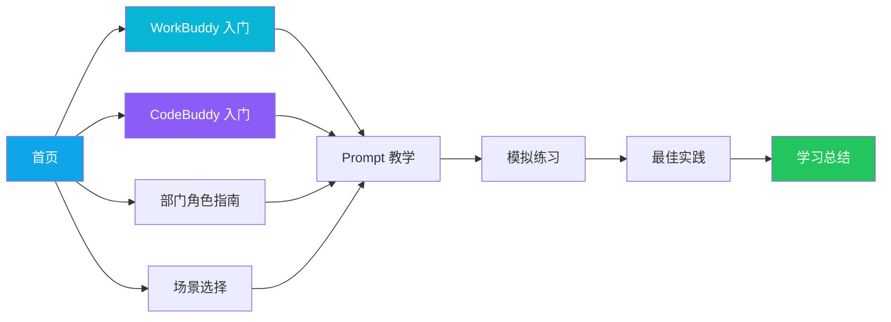
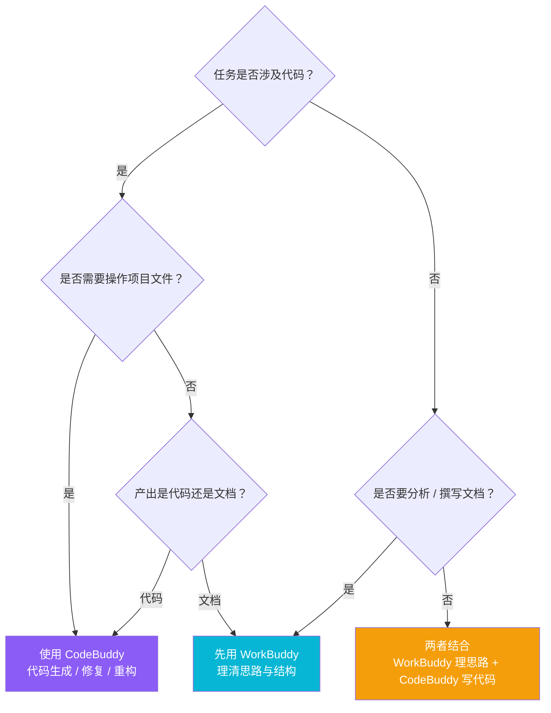

# WorkBuddy & CodeBuddy 入门指南

> 从提出需求到交付结果，快速掌握你的 AI 工作伙伴。


一个面向团队的交互式入门学习 Web 应用，帮助成员快速了解并上手 **WorkBuddy（AI 办公助手）** 与 **CodeBuddy（AI 编程助手）** 两款 AI 工具。项目通过可视化演示、分角色推荐、场景化案例与模拟练习，让零基础用户也能在约 25 分钟内建立起对两款工具的整体认知。

---

## 目录

- [项目简介](#项目简介)
- [功能特性](#功能特性)
- [技术栈](#技术栈)
- [核心模块一览](#核心模块一览)
- [学习路径](#学习路径)
- [工具选择决策树](#工具选择决策树)
- [项目结构](#项目结构)
- [快速开始](#快速开始)
- [学习内容与模块说明](#学习内容与模块说明)
- [数据驱动设计](#数据驱动设计)
- [许可证](#许可证)

---

## 项目简介

在 AI 工具普及的今天，很多同事并不知道「什么时候该用 WorkBuddy，什么时候该用 CodeBuddy」。本项目以一个**引导式学习平台**的形式解决这一问题：

- **WorkBuddy** 侧：聚焦文档撰写、内容分析、会议纪要等办公场景。
- **CodeBuddy** 侧：聚焦代码生成、Bug 修复、项目分析等研发场景。

应用内置完整的学习进度跟踪（基于 `localStorage`），用户可随时离开并「继续上次学习」，并以环形进度条直观看到整体完成情况。

---

## 功能特性

| 特性 | 说明 | 关键文件 |
| --- | --- | --- |
| 🏠 **双入口首页** | 一键进入 WorkBuddy / CodeBuddy 学习路径 | `src/pages/HomePage.tsx` |
| 🧭 **按岗位推荐** | 选择部门与岗位，获取专属使用建议 | `src/components/role/` |
| 📚 **19 个常见场景** | 按 WorkBuddy / CodeBuddy 分类浏览真实案例 | `src/data/scenarios/` |
| 🤔 **工具选择器** | 回答 3 个问题，自动推荐合适工具 | `src/components/ToolSelector.tsx` |
| 💬 **交互式演示** | 模拟聊天、执行状态、结果预览 | `src/components/workbuddy/`、`src/components/codebuddy/` |
| 📝 **Prompt 教学** | 角色 + 目标 + 背景 + 材料 + 约束 + 格式 = 高效提示词 | `src/pages/PromptPage.tsx` |
| 🎯 **模拟练习** | 动手搭建提示词并实时预览 | `src/components/PromptBuilder.tsx` |
| ✅ **最佳实践** | 风险清单与安全使用规范 | `src/pages/BestPracticePage.tsx` |
| 📊 **进度跟踪** | 环形进度、模块完成度、断点续学 | `src/context/AppContext.tsx` |

---

## 技术栈


| 分类 | 选型 | 用途 |
| --- | --- | --- |
| 框架 | React 18 + TypeScript | 组件化 UI 与类型安全 |
| 构建工具 | Vite 5 | 极速开发与构建 |
| 路由 | react-router-dom 6 | 多页面（9 个模块）路由 |
| 样式 | Tailwind CSS 3 + tailwind-merge | 原子化样式与类名合并 |
| 图标 | lucide-react | 统一图标体系 |
| 状态 | React Context + useReducer | 全局学习状态管理 |
| 持久化 | localStorage | 学习进度本地保存 |

---

## 核心模块一览

首页将整个学习拆分为 **9 个模块**，并以可视化卡片呈现 WorkBuddy 与 CodeBuddy 两大入口：

```
┌─────────────────────────────────────────────────────────────┐
│                   首页 Hero（标题 + 双入口）                   │
│   [ 开始学习 WorkBuddy ]          [ 开始学习 CodeBuddy ]      │
├─────────────────────────────────────────────────────────────┤
│  [ 按岗位查看推荐 ]              [ 浏览使用场景（19 个）]      │
├─────────────────────────────────────────────────────────────┤
│            快速判断：我该用哪个工具？（3 问选择器）            │
├─────────────────────────────────────────────────────────────┤
│   学习路径概览：首页 → WorkBuddy → CodeBuddy → 角色 → 场景 …  │
├─────────────────────────────────────────────────────────────┤
│   学习完成度（环形进度条）  ·  继续上次学习 / 查看总结         │
└─────────────────────────────────────────────────────────────┘
```

---

## 学习路径

整体学习流呈线性 + 分支结构，用户可从首页逐模块深入，也可根据角色/场景直达：



---

## 工具选择决策树

不知道该用哪个？应用内置的「工具选择器」本质上是下面这棵决策树：



> 速记口诀：**代码相关 → CodeBuddy ｜ 文档分析 → WorkBuddy ｜ 两者结合 → 先用 WorkBuddy 理思路，再用 CodeBuddy 写代码**

---

## 项目结构

```text
WCintro/
├── index.html                  # 应用入口 HTML
├── vite.config.ts              # Vite 配置（@ 别名指向 src）
├── tailwind.config.js          # 主题色：primary / cyan / violet / indigo
├── postcss.config.js
├── package.json
├── assets/
│   └── cover.png               # README 封面图
└── src/
    ├── main.tsx                # React 挂载入口
    ├── App.tsx                 # 路由 + 全局 Provider（懒加载 9 个页面）
    ├── index.css               # 全局样式
    ├── context/
    │   └── AppContext.tsx      # 全局状态（模块 / 步骤 / 提示词表单）
    ├── hooks/                  # useProgress / useToast 等
    ├── types/                  # 全局类型定义
    ├── utils/                  # storage 等工具
    ├── data/                   # 内容数据（驱动整个应用）
    │   ├── scenarios/          # WorkBuddy / CodeBuddy 场景演示数据
    │   ├── scenarios.ts        # 场景列表
    │   ├── departmentRoles.ts  # 部门 / 岗位角色
    │   ├── promptExamples.ts   # Prompt 教学示例
    │   ├── bestPractices.ts    # 最佳实践 / 风险清单
    │   └── learningSummary.ts  # 学习路径与汇总信息
    ├── components/
    │   ├── common/             # AppLayout / Header / Sidebar / Footer ...
    │   ├── workbuddy/          # 办公助手演示组件（聊天 / 执行 / 结果）
    │   ├── codebuddy/          # 编程助手演示组件（Diff / 终端 / 计划）
    │   ├── role/               # 角色指南组件
    │   ├── ToolSelector.tsx    # 工具选择器
    │   ├── PromptBuilder.tsx   # 提示词构建器
    │   └── ...
    └── pages/                  # 9 个学习模块页面
        ├── HomePage.tsx
        ├── WorkBuddyPage.tsx
        ├── CodeBuddyPage.tsx
        ├── RoleGuidePage.tsx
        ├── ScenarioPage.tsx
        ├── PromptPage.tsx
        ├── PracticePage.tsx
        ├── BestPracticePage.tsx
        └── SummaryPage.tsx
```

---

## 快速开始

### 环境要求

- Node.js ≥ 18
- npm（或 yarn / pnpm）

### 安装与运行

```bash
# 1. 安装依赖
npm install

# 2. 启动开发服务器（默认 http://localhost:5173）
npm run dev

# 3. 构建生产版本
npm run build

# 4. 本地预览构建产物
npm run preview
```

> 开发服务器已配置 `host: 0.0.0.0` 与 `allowedHosts: true`，可在局域网 / 容器环境中直接访问。

---

## 学习内容与模块说明

| # | 模块 | 主要内容 |
| --- | --- | --- |
| 1 | 首页 | 双入口、角色推荐、场景入口、学习路径与进度 |
| 2 | WorkBuddy 入门 | 办公助手完整工作流：描述场景 → 明确目标 → 提供材料 → 查看执行 → 检查结果 → 迭代优化 → 导出交付 |
| 3 | CodeBuddy 入门 | 编程助手完整工作流：打开项目 → 描述需求 → 分析结构 → 查看计划 → 生成代码 → 检查 Diff → 运行验证 → 迭代修复 → 完成 |
| 4 | 部门角色指南 | 按部门 / 岗位推荐工具与场景 |
| 5 | 场景选择 | 浏览 19 个常见场景（含 3 个 WorkBuddy 精选 + 3 个 CodeBuddy 精选交互演示） |
| 6 | Prompt 教学 | 高效提示词公式与示例 |
| 7 | 模拟练习 | 动手搭建并预览提示词 |
| 8 | 最佳实践 | 安全规范与风险清单 |
| 9 | 学习总结 | 知识回顾与要点巩固 |

**高效提示词公式：**

```
角色 + 目标 + 背景 + 输入材料 + 约束条件 + 输出格式 + 验收标准 = 高效 Prompt
```

**使用风险提示：**

- 不要输入敏感信息（密钥、密码、客户隐私数据）
- AI 输出需要人工核验，不是最终版本
- 不理解的终端命令不要执行
- 重要代码必须经过 Code Review
- 单次不要改太多文件，分步推进更可控

---

## 数据驱动设计

整个应用的内容（场景、角色、提示词示例、步骤、代码演示等）都集中在 `src/data/` 中，以纯数据（TypeScript 模块）形式维护。页面与组件通过读取这些数据渲染，实现 **内容 / 视图分离**，方便非开发人员持续补充案例而无需改动业务逻辑。

- 场景演示数据支持「精选场景 + 通用模板」两种模式：精选场景提供完整交互演示，其余场景由 `generateGenericWBData` / `generateGenericCBData` 自动生成基础演示。
- 学习进度通过 `useProgress` 写入 `localStorage`（键名 `learning_progress`），刷新或重开浏览器后自动恢复。

---

## 许可证

本项目为内部学习演示用途，仅供团队入门培训使用。
